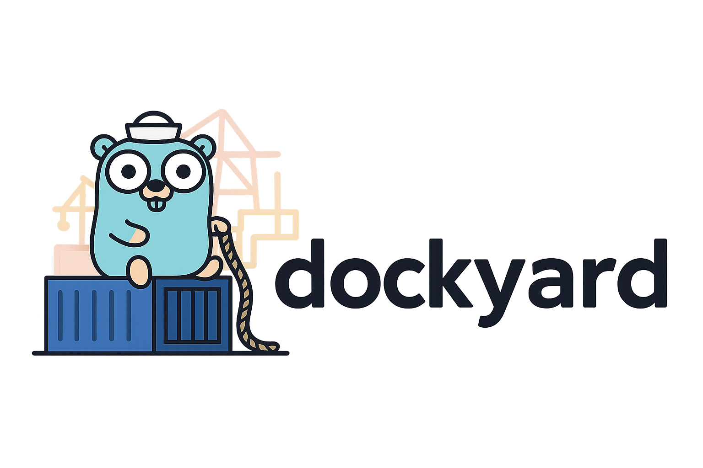

<div align="center">
  

*A CLI tool for managing your Dockerized projects*

[](https://golang.org/)
[](https://docker.com/)
[](LICENSE)
</div>

---

## ✨ What is Dockyard?

Dockyard is a humble yet powerful CLI application designed to simplify your Docker workflow. Born from the need to elegantly manage my multiple Dockerized projects, it provides an intuitive interface that makes container orchestration feel effortless.

### 🎯 Key Features

- **🎮 Interactive Project Selection** - Terminal UI powered by survey prompts
- **⚡ Quick Operations** - Start, stop, and manage projects with simple commands
- **📋 Project Overview** - List all your projects and their current status
- **🔧 Smart Management** - Add, remove, and configure projects seamlessly
- **📁 Flexible Configuration** - JSON-based project definitions with home directory support

---

## 🚀 Getting Started

### Prerequisites

- **Go 1.20+** - [Download Go](https://golang.org/dl/)
- **Docker & Docker Compose** - [Get Docker](https://docs.docker.com/get-docker/)

### Installation

```bash
# Clone the repository
git clone git@github.com:mkdir3/dockyard.git
cd dockyard

# Build the application
go build -o dockyard

# (Optional) Install globally
sudo mv dockyard /usr/local/bin/
```

### Quick Setup

1. **Create your projects configuration (Optional):**
   ```bash
   cp projects.json.example projects.json
   ```

2. **Configure your projects** in `projects.json` **(Optional)**:
   ```json
   {
     "my-app": "~/Projects/my-awesome-app",
     "api-server": "~/Development/backend-api",
     "frontend": "/absolute/path/to/frontend"
   }
   ```

3. **Start managing your projects:**

   If you haven't manually configured your projects, Dockyard will prompt you to add projects interactively.
   ```bash
   ./dockyard
   ```

---

## 🎨 Usage

### 🏃‍♂️ Interactive Mode (Default)
Simply run `dockyard` to enter the beautiful interactive mode where you can select and start multiple projects:

```bash
./dockyard
```

### 📋 List All Projects
View all configured projects and their paths:

```bash
./dockyard list
```

### 🚀 Start Specific Projects
Quickly start projects without interactive selection:

```bash
./dockyard start project1 project2
```

### 🛑 Stop Running Projects
Gracefully stop your running containers:

```bash
./dockyard stop project1 project2
```

### ⚙️ Manage Projects
Add, remove, or modify your project configurations:

```bash
./dockyard manage
```

---

## 📁 Project Structure

```
dockyard/
├── 📄 main.go              # Application entry point
├── 📁 cmd/                 # CLI commands
│   ├── root.go            # Root command & interactive mode
│   ├── list.go            # List projects command
│   ├── start.go           # Start projects command  
│   ├── stop.go            # Stop projects command
│   └── manage.go          # Project management command
├── 📁 pkg/
│   ├── 🐳 docker/         # Docker operations
│   │   ├── compose.go     # Docker Compose execution
│   │   ├── projects.go    # Project loading & management
│   │   ├── select.go      # Interactive project selection
│   │   └── fileops.go     # File operations
│   └── 🛠️ utils/          # Utility functions
│       ├── paths.go       # Path resolution
│       └── projectinfo.go # Project information display
├── 📄 projects.json        # Your project configurations
└── 📁 assets/
    └── logo.png           # Beautiful Dockyard logo
```

---

## 🛠️ Configuration

### Projects Configuration (`projects.json`)

```json
{
  "project-name": "path/to/project",
  "api-backend": "~/Development/my-api",
  "web-frontend": "/Users/dev/Projects/frontend",
  "database": "~/Docker/postgres-setup"
}
```

**Path Support:**
- ✅ Home directory expansion (`~/path`)
- ✅ Absolute paths (`/full/path`)
- ✅ Relative paths (relative to dockyard location)

---

## 🤝 Contributing

This is a humble first Go project, and any contributions are warmly welcomed! Whether it's:

- 🐛 Bug fixes
- ✨ New features
- 📚 Documentation improvements
- 🎨 UI/UX enhancements

Feel free to open an issue or submit a pull request.

---

## 📜 License

This project is open source and available under the [MIT License](LICENSE).

---

<div align="center">

**Made with ❤️ and Go**

_aëldrin\_sagë -_ 🐻- _mkdir3_

</div>